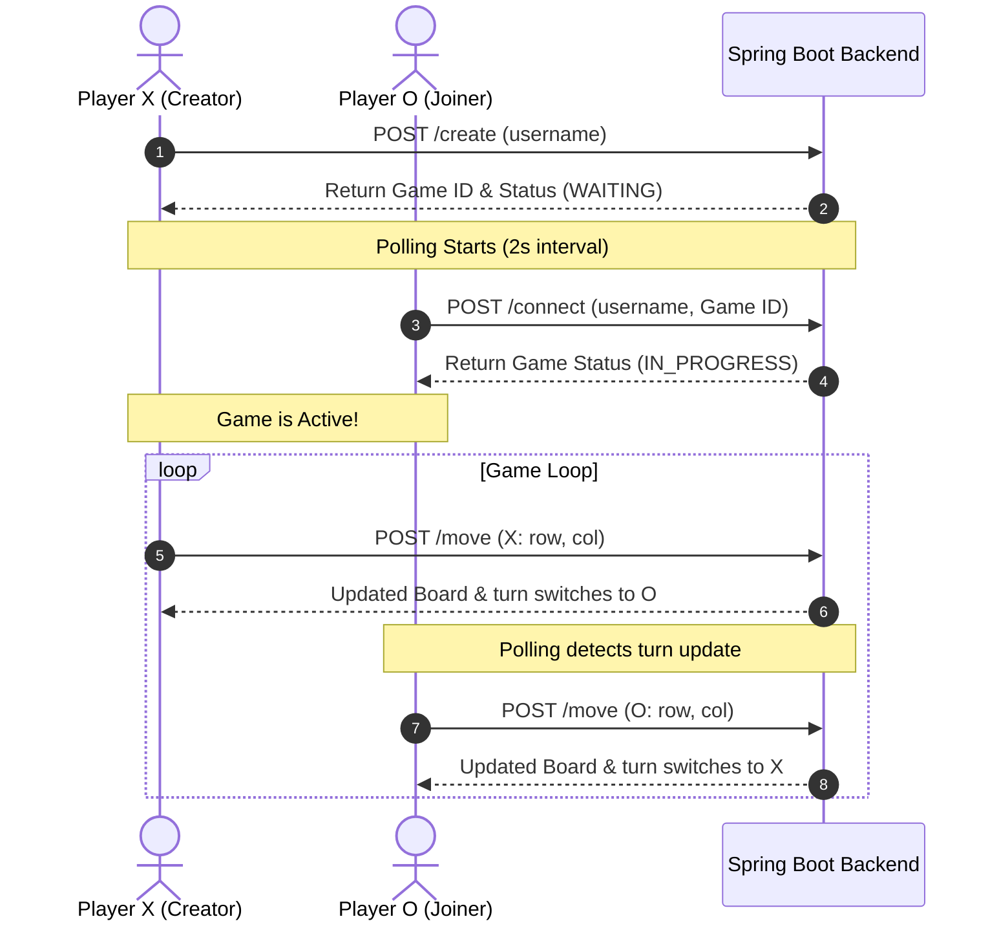

# 🎮 Real-Time Full-Stack Tic-Tac-Toe

A modern, high-performance, and visually stunning multiplayer **Tic-Tac-Toe** web application. Built with a robust **Spring Boot 3 (Java 21)** backend for real-time game coordination and a premium, responsive **React 19 (TypeScript + Vite)** frontend styled with rich, glassmorphic dark-mode aesthetics.

---

## 🎨 Design & Visuals

The user interface of this Tic-Tac-Toe application features a premium and futuristic dark mode design:
- **Glassmorphism**: Built using high-end CSS backdrop filters (`blur(12px)`) with subtle white borders creating a beautiful frosted glass aesthetic.
- **Dynamic Glows**: Custom text shadows that dynamically illuminate symbols—X glows in **Rose Red** (`#f43f5e`) and O glows in **Emerald Green** (`#10b981`).
- **Typography & Transitions**: Styled with the modern **Outfit** Google Font and interactive scale transitions (`cubic-bezier`) that react instantly to player hovers and clicks.

---

## 🏗️ Architectural Overview

The application utilizes a classic **Client-Server Architecture** operating over high-performance HTTP REST endpoints:



### Technical Workflow:
1. **Session Initialization**: Player 1 creates a game lobby which generates a unique `UUID` session token on the backend.
2. **Lobby Connection**: Player 2 joins using the shared UUID, promoting the session status to `IN_PROGRESS`.
3. **Turn Synchronization**: State coordination is maintained using a low-latency 2-second HTTP polling mechanism, checking the active status and board values on the server.
4. **State Engine**: The Java backend computes wins, draws, coordinates boundary constraints, turn validation, and occupancy status.

---

## 🚀 Key Features

*   **⚡ Multiplayer Real-Time Coordination**: Seamless matchmaking using unique game session tokens (UUIDs).
*   **🔮 High-End UX/UI**: Fully-responsive fluid grid system with subtle glowing elements, dark-mode gradients, and sleek interactive transitions.
*   **🛡️ Strong Data Integrity**: Backend-enforced validation prevents invalid turns, board boundary violations, or cell hijacking.
*   **🧩 Thread-Safe Session Handler**: Built with in-memory `ConcurrentHashMap` caching to handle multiple simultaneous game lobbies efficiently.
*   **🩺 Clean Error Boundaries**: Global exception handling translates Spring-side failures into human-readable UI alerts.
*   **📋 Direct Clipboard Sharing**: Quick button to copy and share the Game ID with opponents.

---

## 🛠️ Tech Stack

### Frontend Architecture
- **Framework**: [React 19](https://react.dev/) (Modern functional components with Hook-based state lifecycle)
- **Language**: [TypeScript](https://www.typescriptlang.org/) (Strictly-typed endpoints, models, and UI props)
- **Build Tool**: [Vite 8](https://vite.dev/) (Lightning-fast HMR and bundling)
- **Styling**: Vanilla CSS3 Custom Properties (Tailored variables for glassmorphism, responsive grid, and HSL palettes)
- **Icons & Typography**: [Google Fonts: Outfit](https://fonts.google.com/specimen/Outfit)

### Backend Architecture
- **Framework**: [Spring Boot 3.4.4](https://spring.io/projects/spring-boot) (Micro-framework ready for cloud scaling)
- **Language**: [Java 21](https://openjdk.org/) (Leveraging modern runtime performance and record serialization)
- **Build & Dependency Manager**: [Maven](https://maven.apache.org/)
- **Data Persistence Strategy**: 
  - **Active State**: In-memory caching (`InMemoryGameRepository` using thread-safe structures).
  - **Ready for DB**: Configured with a reactive PostgreSQL runtime driver (`pom.xml`) for fast migration to SQL persistence.

---

## 📂 Directory Layout

```text
tictactoc_fullStackProject/
├── backend/
│   └── tixtactoe/
│       ├── src/
│       │   ├── main/
│       │   │   ├── java/com/projects/tixtactoe/
│       │   │   │   ├── controller/          # REST Endpoint Controllers (CORS Enabled)
│       │   │   │   ├── dto/                 # Client Request Data Objects
│       │   │   │   ├── exception/           # Business and Global Exception Handlers
│       │   │   │   ├── model/               # Game, Player, Marks and GameState Domains
│       │   │   │   ├── repository/          # In-memory Cache Data Repositories
│       │   │   │   └── service/             # Win/Draw validation & state-machine logic
│       │   │   └── resources/
│       │   │       └── application.properties
│       │   └── test/                            # Backend Unit and Integration Tests
│       ├── pom.xml                              # Maven Configuration & Dependencies
│       └── mvnw                                 # Maven Wrappers
└── frontend/
    ├── src/
    │   ├── api/                                 # HTTP services calling Backend Controllers
    │   ├── types/                               # TypeScript Type Definitions matching Java DTOs
    │   ├── App.tsx                              # Main Game Dashboard and polling engine
    │   ├── index.css                            # Glassmorphism design tokens & styles
    │   └── main.tsx                             # React 19 Entrypoint
    ├── vite.config.ts                           # Vite configuration
    ├── package.json                             # Dependencies (React, Typescript, ESLint)
    └── tsconfig.json                            # TypeScript configuration compiler options
```

---

## 🔌 API Endpoints Contract

All endpoints are mapped under the base route `/api/game`.

| Endpoint | Method | Payload | Response Type | Description |
| :--- | :---: | :--- | :--- | :--- |
| `/create` | `POST` | `Player` | `Game` | Creates a new game session and returns the generated UUID. |
| `/connect` | `POST` | `ConnectRequest` | `Game` | Connects a second player to the active lobby. |
| `/move` | `POST` | `MoveRequest` | `Game` | Validates and commits an active move. |
| `/{gameId}` | `GET` | *None* | `Game` | Returns the detailed current state of the board and session. |

### DTO Specifications

#### `Player` (JSON payload):
```json
{
  "username": "AlphaPlayer"
}
```

#### `ConnectRequest`:
```json
{
  "player": { "username": "BetaPlayer" },
  "gameId": "73e970a0-fa71-4ebc-87d3-0570b22b10df"
}
```

#### `MoveRequest`:
```json
{
  "gameId": "73e970a0-fa71-4ebc-87d3-0570b22b10df",
  "playerMark": "X",
  "row": 1,
  "col": 2
}
```

---

## 🏃 Getting Started

To run this project locally, ensure you have the following prerequisites installed:
*   [Java Development Kit (JDK) 21+](https://adoptium.net/)
*   [Node.js (v18.0.0+)](https://nodejs.org/)
*   [Maven](https://maven.apache.org/) (optional, mvnw wrapper included)

### Step 1: Start the Spring Boot Backend
1. Open a terminal and navigate to the backend folder:
   ```bash
   cd backend/tixtactoe
   ```
2. Build and run the server using Maven:
   ```bash
   ./mvnw spring-boot:run
   ```
   *(On Windows Command Prompt, use `mvnw.cmd spring-boot:run`)*
3. The server will launch and bind to `http://localhost:8080`.

### Step 2: Start the React Frontend
1. Open a new terminal and navigate to the frontend folder:
   ```bash
   cd frontend
   ```
2. Install npm dependencies:
   ```bash
   npm install
   ```
3. Boot the local development server:
   ```bash
   npm run dev
   ```
4. Open the URL shown in the terminal (usually `http://localhost:5173`) in your web browser.

---

## 🔮 Future Roadmap

*   **🔌 WebSockets (STOMP/SockJS)**: Transition the real-time system from 2-second HTTP polling to full two-way WebSocket communication for near-zero latency turn updates.
*   **💾 Database Integration**: Fully wire up the Postgres JPA layer to persist matches, wins, losses, and player leaderboards.
*   **🤖 AI Opponent (Single Player)**: Integrate a minimax-based backend AI agent for players who want to practice offline.
*   **🏆 Global Leaderboards**: Introduce high-scores and custom player profile stats.
